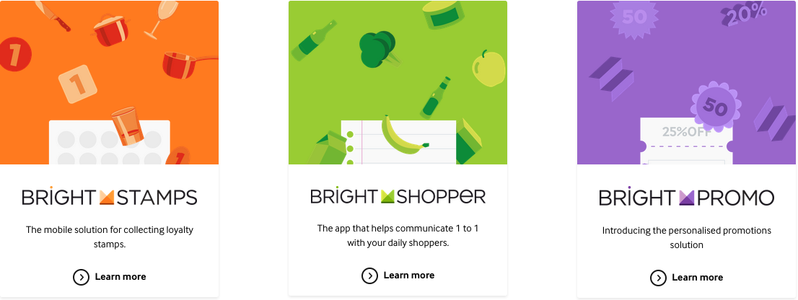
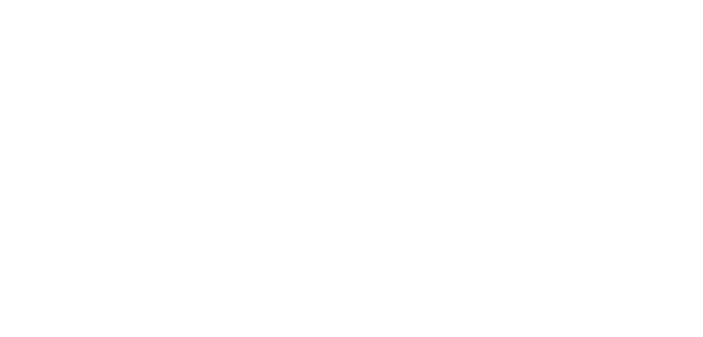
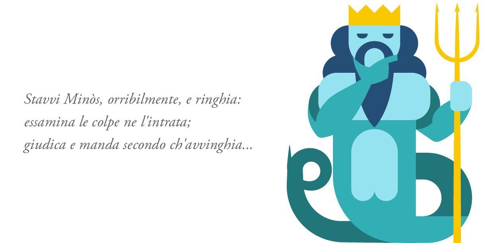

# [fit]Bringing innovation to hearts and wallets: 
# [fit]scaling loyalty with node.js

---

# Who am I?
## [fit]
## [fit]
## [fit]
## @lucamaraschi
- Architect @ IceMobile during the day
- *Node.js*  and *SmartOS* Italian lover (during the night!)
- International speaker

---

# [fit]IceMobile

# [fit]Digital loyalties for *Food Retailers*

—

# [fit]What are we doing?

—

—

# [fit]Paper stamps =>
# [fit]Digital stamps!

—

# [fit]Our 5 *core*
# [fit]Values

—

# [fit]1. Magic happens 
# [fit]at the intersection

—

# [fit]2. Focus on people
# [fit]and all else will follow

—

# [fit]3. Change is the
# [fit]only constant

—

# [fit]4. Simplicity is
# [fit]the ultimate sophistication

—

# [fit]5. DO EPIC SHIT!

—

> Scale on people, hardware will follow.
— Luca Maraschi

—

# [fit]Once upon a time…
### [fit]your first day at the office

—

—

# [fit]and…

—

# [fit] Automatically deployed
# [fit] by a human being!

—

# [fit]Well…

—

# [fit] we learnt fast that

—

# [fit] It did not scale…

—

# [fit] cost effectively

—

# [fit] no ease of change

—

# [fit] ~~LEAN UX~~

—

—

> E quindi uscimmo a riveder le stelle
— Dante (Inferno XXXIV, 139)

—

# [fit]Microservices
# [fit]because it’s hipster!

—-

# [fit]Bye bye db transactions
# [fit]welcome Event Sourcing

—

# [fit]Command
# [fit]Query
# [fit]Responsibility
# [fit]Segregation

—

# [fit]From bare metal
# [fit]to the cloud (AWS)

—

# [fit]Continuous delivery
# [fit]using Docker

—

—

# [fit]Fail fast
# [fit]to learn faster

—-

# [fit]JS != Java + script

—

# [fit]vim | atom != IDE

—

# [fit]Shape your own
# [fit]”best practices”

—

# [fit]Success = 
# [fit]social/cultural change

—

# [fit]Testers = devs = testers

—

# [fit]Statements 
# [fit]or suggestions!

—

# [fit]Restify

—

# [fit]DTrace
## [fit]or don’t complain to me!

—

# [fit]Don’t forget 
# [fit]your dump!

—

# [fit]npm shrinkwrap

—

# [fit]Nginx
# [fit]or die!

—

# [fit]and code some lua!

—

# [fit]Give to Get

—

# [fit]github.com/icemobilelab

—

# github.com/icemobilelab/virgilio

—

# [fit]Application scaling framework

—

# github.com/icemobilelab/minosse

—

# [fit]Test your api using Cucumber.js

—

> A framework is a CSL, a Company Specific Language
— Luca Maraschi, NodeSummit 2015

—

# [fit]icemobile.com/tech

—

# [fit] Thank you!

