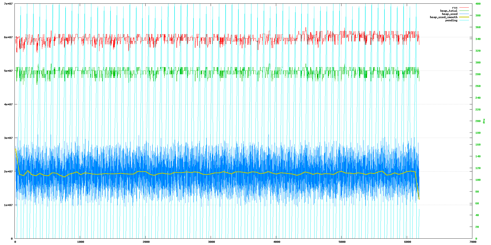
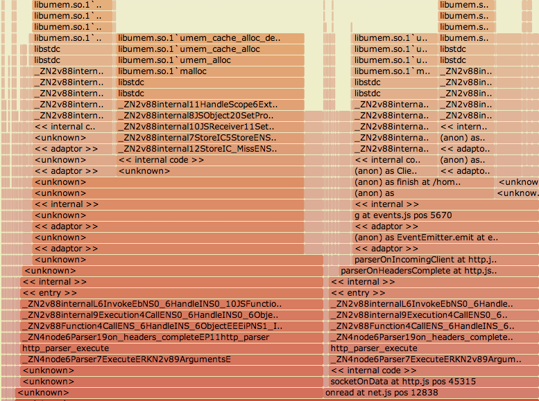
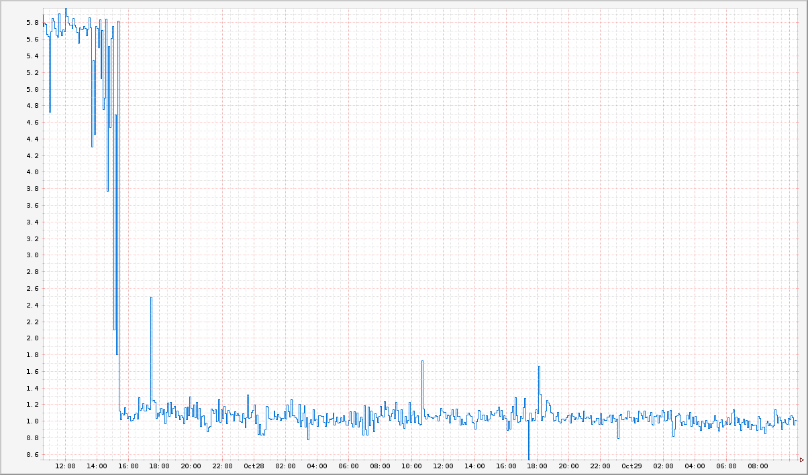
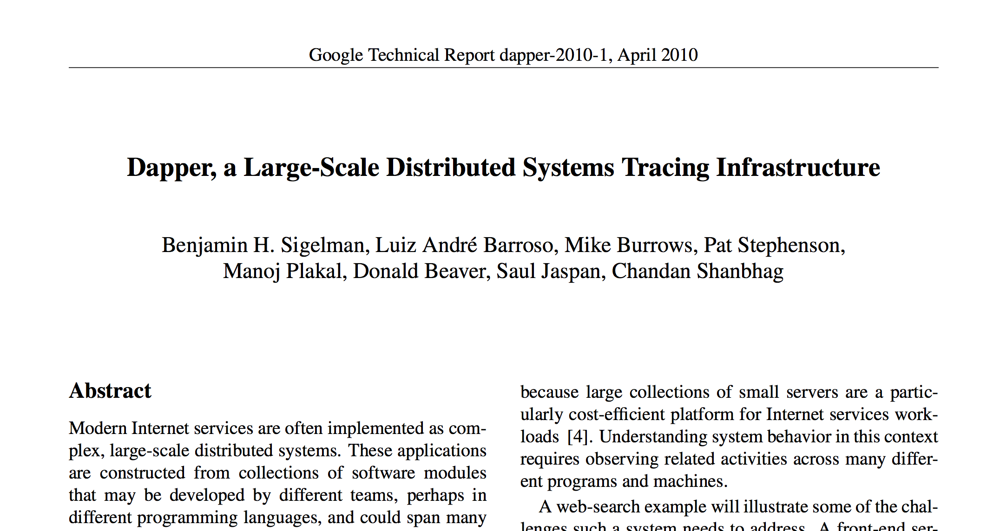
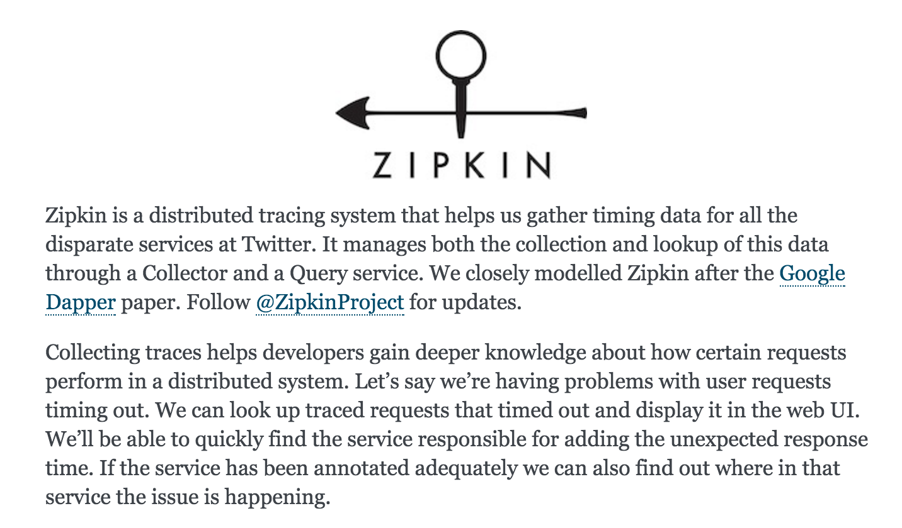
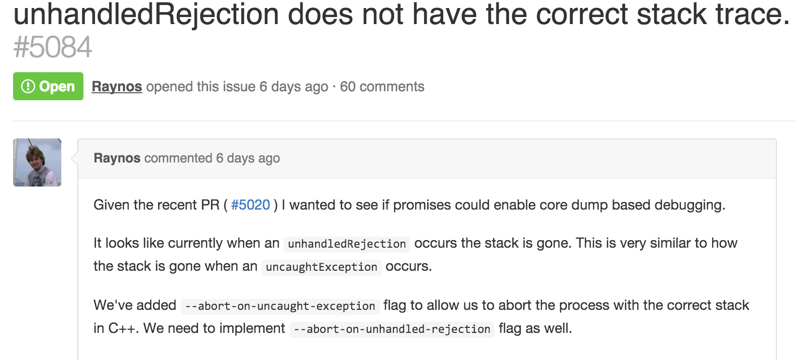
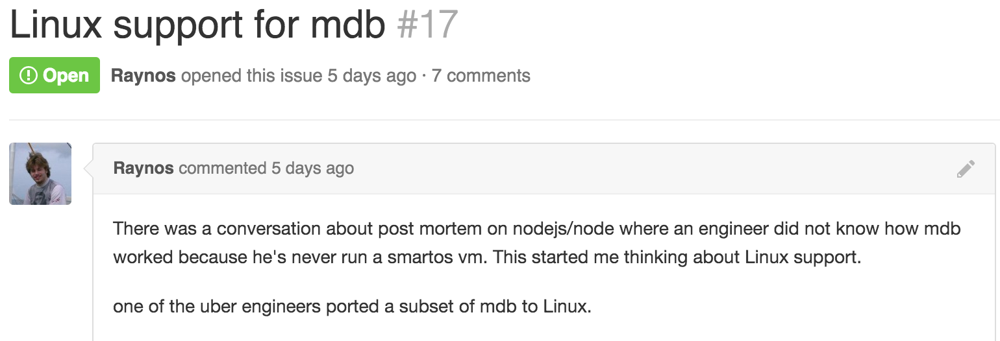
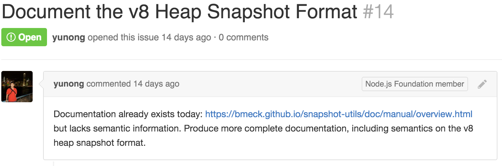
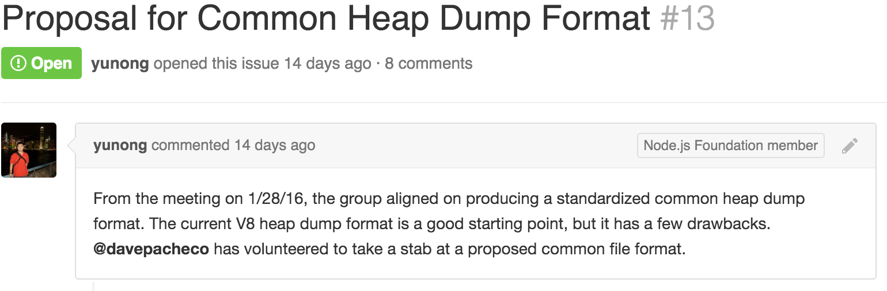

# [fit] TO BE
# [fit] ANNOUNCED

—

# [fit] The **Day** after 
# [fit] **PRODUCTION**

---

# [fit] _**@lucamaraschi**_

---

# [fit] :heart: :shit:

—

# [fit] I LOVE **CORE DUMPS**!

—


—

# [fit] do epic shit!

—

> "Production is WAR"
-- Bryan Cantrill

---


—

# [fit] 3 stories
# [fit] of real production war

—

# [fit] at **scale**!

—

# ya…
# [fit] **we faced all 3!**

—

> “Poor is the pupil who does not surpass his master.”
— Leonardo da Vinci

—

# [fit] **1.**
## [fit] Walmart

—

# [fit] _The **’handleScope’** Saga_

—

# [fit] _handleScope_
### __keeps track of the objects on stack__

—



—



—

# [fit] 150MB leak per day!

—

# [fit] down to 22…

—

# [fit] but still **too much** 
### for the volume of Walmart!

—

# [fit] 3 months of debugging…

—

# [fit] mdb…
### or suffer!

—

# [fit] and Dtrace…
#### or die!

—

# [fit] Yep…and our workers
# [fit] **were leaking** too! ;-)

—

# [fit] Thank you **Walmart**!

—

# [fit] :heavy_check_mark:

—

# [fit] **2.**
## [fit] Netflix

—

# [fit] _Node.js in **’Flames’**_

—


—

# [fit] v8 **perf_events**

—

# [fit] Flame graphs

—

# [fit] and…

—

# [fit] Route handlers stored
# [fit] in **1** global array

—

# [fit] Express.js **recursively** iterates and invokes 
# [fit] **all** handlers 
# [fit] until it finds the right one!

—

```javascript
next();

  function next(err) {
    if (err && err === 'route') {
      return done();
    }

    var layer = stack[idx++];
    if (!layer) {
      return done(err);
    }

    if (layer.method && layer.method !== method) {
      return next(err);
    }

    if (err) {
      layer.handle_error(err, req, res, next);
    } else {
      layer.handle_request(req, res, next);
    }
  }
```

—



—

# [fit] the answer
# is…

—

# [fit] **Restify**

—

# [fit] First class resident
# [fit] **Traceability**

—

# [fit] but how?

—

# [fit] Bunyan

—

# [fit] Dtrace probes
#### or die! 

—

# [fit] Thank u **Netflix**!
### and chill… 

—

# [fit] :heavy_check_mark:

—

# [fit] **3.**
## [fit] Joyent

—


—

# [fit] _PostgreSQL **autovacuum**_

—

# [fit] github.com/joyent/**pglockanalyze**

—

# [fit] Thank you **Joyent**!

—

# [fit] in progress…

—

# [fit] actually…
# [fit] I just heard…

—

# [fit] **quote_literal()**
# [fit] vs.
# [fit] **quote_ident()**

—

# [fit] wrong quote
# [fit] ===
# [fit] **∞** LOOP

—


—

# [fit] Production
# [fit] __Operability__

—

# [fit] ?

—

# [fit] Traceability

—

# [fit] Post-mortem

—

# [fit] github.com/nodejs/**tracing-wg**
# [fit] github.com/nodejs/**post-mortem**

—



—



—

# [fit] --abort-on-uncaught-exception

—



—

# [fit] what’s next?

—

# [fit] post-mortem analysis
# [fit] **cross platform!**

—

# [fit] **mdb** like
# [fit] everywhere!

—



—



—



—

# [fit] github.com/indutny/**llnode**
## @indutny

—

# [fit] **Community** driven
# [fit] enterprise **effort**

—

### *“One reason I think debugging is so hard: you need to know much more about how computers work to debug than you do to program.”*

#### Dave Pacheco(Twitter - 18 August 2015)

---

# [fit] Thank you all!
### **do u like Epic Shit?**
## **JOIN #IceMobile!**


