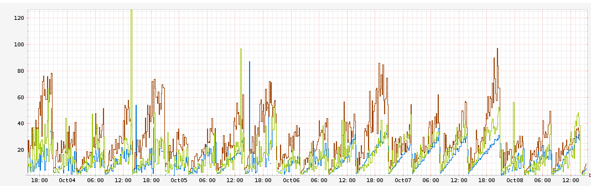

# [fit] The day after 
# [fit] Production

---

# [fit] _**@lucamaraschi**_

---

# [fit] :heart: :shit:

—


—

> "Production is WAR"
-- Bryan Cantrill

---

# 3 stories
# of real production war

—

# [fit] at **scale**!

—

# ya…
# [fit] **we faced all 3!**

—

> “Poor is the pupil who does not surpass his master.”
— Leonardo da Vinci

—

# [fit] **1.**
## [fit] Walmart

—

# [fit] _The **’handleScope’** Saga_

—


—

# [fit] Thank you **Walmart**!

—

# [fit] :heavy_check_mark:

—

# [fit] **2.**
## [fit] Netflix

—

# [fit] _Node.js in **’Flames’**_

—



—

# [fit] v8 **perf_events**

—

# [fit] Flame graphs

—

# [fit] Route handlers stored
# [fit] in **1** global array

—

# [fit] Express.js **recursively** iterates and invokes 
# [fit] **all** handlers 
# [fit] until it finds the right one!

—

```javascript
next();

  function next(err) {
    if (err && err === 'route') {
      return done();
    }

    var layer = stack[idx++];
    if (!layer) {
      return done(err);
    }

    if (layer.method && layer.method !== method) {
      return next(err);
    }

    if (err) {
      layer.handle_error(err, req, res, next);
    } else {
      layer.handle_request(req, res, next);
    }
  }
```

—


—

# [fit] Restify

—

# [fit] First class resident
# [fit] Traceability

—

# [fit] Bunyan

—

# [fit] Dtrace
#### or die! 

—

# [fit] **3.**
## [fit] Joyent

—


—

# [fit] _PostgreSQL **autovacuum**_

—

# [fit] github.com/joyent/**pglockanalyze**

—

# [fit] Thank you **Joyent**!

—

# [fit] Production
# [fit] __Operability__

—

# [fit] ?

—

# [fit] Traceability

—

# [fit] Post-mortem

—

# [fit] github.com/nodejs/**tracing-wg**
# [fit] github.com/nodejs/**post-mortem**

—

# [fit] Post-mortem & node.js
# [fit] what’s next?

—

### *“One reason I think debugging is so hard: you need to know much more about how computers work to debug than you do to program.”*

#### Dave Pacheco(Twitter - 18 August 2015)

---

# [fit] :heart:


