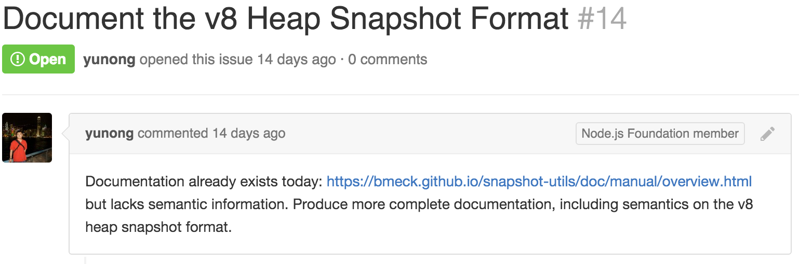
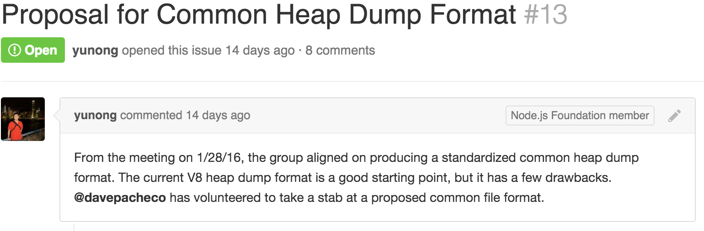

# [fit]Node Speleology
## [fit] Digging into your node app

---

# [fit]The magic dump :shit:
## [fit]when something in node goes wrong

—

# [fit] A Cluedo like experience
# [fit] More a story than a demo!

—

# [fit] We all like stories
# [fit] They inspire us
# [fit] So we remember them...

---

# Who Am I?
## @lucamaraschi
## **node.js contributor**
## [fit]“:heart: {core}Dumps Watching”

—

# [fit] @node/post-mortem
# [fit] @node/tracing

---

# [fit] Life of a debugger!

—

# [fit] Disclaimers
# [fit] it did not take *ONLY 30 minutes*
# [fit] I do not work for Joyent(yet!)!

—

# [fit] But all these things…
# [fit] only work on SmartOS!
# [fit] sorry Linux!

—

# [fit] But don’t worry…
# [fit] you can still dump on linux!

—

# [fit]Sorry take CORE DUMPS!

—

# [fit] @indutny
# [fit] https://github.com/indutny/llnode

---

# [fit] Like everybody else
# [fit] I deployed node in production
# [fit] and…

—

# [fit] 3AM
# [fit] …and this

—


—

> "Production is WAR"
-- Bryan Cantrill

---

# [fit] AWS

---

# while(true) {
### [fit] ELB_kills_machines();
### [fit] ELB_spawns_new();
# }

—

# [fit] ELB trashes the machines!
# [fit] no way to get it back!

—

# [fit] but it was just a
# [fit] Nightmare!
# [fit] because it already happened in the afternoon!

—

# [fit] Microservices...
#### such a pain sometime...but so HIPSTERS!

—


—

# [fit] Let’s the hack begin!

—

# [fit] Let’s take a dump
# [fit] on AWS…sorry of node on AWS!

—

# [fit] Straight to a
# [fit] SmartOS machine!

—

# [fit] WHY?
# [fit] dtrace + mdb!!!

—

# [fit] Dtrace
> "DTrace is a comprehensive dynamic tracing framework created by Sun Microsystems for troubleshooting kernel and application problems on production systems in real time."

---

# Let’s Dtrace the nginx machine…

```d
pid$target::*ngx_http_process_request:entry
{
    this->request = (ngx_http_request_t *)copyin(arg0,sizeof(ngx_http_request_t));
    this->request_line = stringof(copyin((uintptr_t)this->request->request_line.data,
                                         this->request->request_line.len));
    printf(“request line = %s\n”, this->request_line);
    printf(“request start sec = %d\n”, this->request->start_sec);
}
```

—

# [fit] Shows all the requests informations
# [fit] and…HIGH LATENCY!

—

# [fit] BINGO!
# [fit] but it’s not NGINX!
# [fit] D’OH!

—

# [fit] Let’s move to the app…

—

# [fit] restify
#### or die!

—

# [fit] Logger of choice is
# [fit] BUNYAN
#### or die!

—

# Step 1
## Let me check what’s going wrong

```sh
prstat -c -x $(pgrep -o -x node)
```

—

# [fit] memory ++
# [fit] CPU ++
# [fit] == > latency!

—

# [fit] Looks like the
# [fit] usual problem!

#### which does not help at all!

—

# [fit] Step 2
# [fit] Check the logs!
# [fit] Log Snooping
# [fit] via dtrace! ;-)
### Thanks Trent Mick

—

# Let’s enable all logs
## without restarting the machine! ;-)

```sh
dtrace -x strsize=4k -qn ‘bunyan*:::log-*{printf(“%d: %s: %s”, pid, probefunc, copyinstr(arg0))}’
```

## or just

```sh
bunyan -p $(pgrep -o -x node)
```

—

# [fit] but still nothing…
# [fit] interesting or useful
### Useless logs!

---

# [fit] @joyent/nhttpsnoop

—

^ Let me see what is taking so much time!
^ Let me summon the probes that restify is feeding

# Step 3
## Enable all the node http probes

```sh
nhttpsnoop -gl
```

## A lot of garbage collection time…
### Interesting…

—

# Step 4
## Let me see who is taking so much time…
## Check for live latency on a siege attack!

—

```d
#!/usr/sbin/dtrace -s
#pragma D option quiet
#pragma D option aggpack
#pragma D option aggsortkey

restify*:::route-start
{
   track[arg2] = timestamp;
}

restify*:::handler-start
/track[arg3]/
{
   h[arg3, copyinstr(arg2)] = timestamp;
}

restify*:::handler-done
/track[arg3] && h[arg3, copyinstr(arg2)]/
{
   @handlers[copyinstr(arg1),copyinstr(arg2)] =
     lquantize((timestamp - h[arg3, copyinstr(arg2)]) / 1000000, 0, 25, 1);
   h[arg3, copyinstr(arg2)] = 0;
}

restify*:::route-done
/track[arg2]/
{
   @routes[copyinstr(arg1)] =
     lquantize((timestamp - track[arg2]) / 1000000, 0, 25, 1);
   track[arg2] = 0;
}

END
{
        printf(“ROUTE LATENCY (milliseconds)”);
        printa(@routes);
        printf(“\nHANDLER LATENCY (milliseconds)\n”);
        printa(@handlers);
}
```

—

# [fit] EUREKA!
## [fit] I found the piece of code…
## [fit] Unfortunately it’s a big method! :-(

—

# [fit] Only way to find the “*leak*”
# [fit] is to put my hand in the
# [fit] DUMP!

—

# [fit] It’s a dirty job…

—

^ We move to the core dump part…so live we could not really see a lot and now we have some suspects where to check for our leak!

# [fit] Luckly…
# [fit] we run node with
# [fit] *—abort-on-uncaught-exception*

—

# [fit] Generates a core dumps
# [fit] when the app crashes.

—

# [fit] What is a core dump?
# [fit] memory segment snapshot

—

# [fit] That’s the exciting moment…

—

# Step 0
## Run node with low level memory infos

```sh
UMEM_DEBUG=“default,audit=200” node —expose-gc —always-compact server.js
```

## Do not do it at home!
## High overhead!

—

# Step 1
## Take a dump every minute!
### It keeps clean and we can see what’s wrong!

```sh
for i in $(seq 1 100); do
  pmap -x $1 >> ./shared_volume/
  gcore $1 >> ./shared_volume/
  sleep 60
done
```

—

# [fit] Check the memory allocation
# [fit] HEAP, anon or stack?

—

# [fit] pmap diff
# [fit] heap++
# [fit] === troubles!

—

# Recap
- Concurrency: peak of 200 user/sec
- User signed requests
- Response Payload: ~ 16kb
- Every machine crashed every ~ 5 minutes
- Memory sky high
- CPU just on drugs!

—

# Ok let’s start

- load the core file `mdb /shared_volume/core.[pid]`
- load the v8 symbols `::load v8.so`
- I feel lucky `::findleaks`
- Too bad… :-(

—

# But luckily something nice was added…
# ::findjsobjects -p {objectname}
## and we can print it out… {add_ptr}::jsprint

—

# [fit] Unleash the beast…
# [fit] ::jsfunctions
# [fit] and we find the ptr to the handler

—

# [fit] Almost there…
# [fit] ::jsscope
# [fit] shows all the variable references

—

# [fit]Tattarattata

—

# [fit] OK, I got the property

—

# [fit] Now let’s see all the references
# [fit] ptr::findjsobjects -r

—

# [fit]WHAT???
# ~ 1M references to the prop

—

# [fit]Strange…

—

# [fit] Ok, let me see the source…
# [fit] ptr::jssource

—

# [fit]It doesn’t look right…
# [fit]Damn observer!!!

—

# [fit]Is anybody referencing
# [fit]The wrong object?
# [fit]leaked observer???

—

# [fit]SHIT!!!

—

# [fit] Back ALIVE!

—

# [fit] USE RxJS
# [fit] github.com/Reactive-Extensions/RxJS

—

# [fit] The future of post-mortem?

—

# [fit] post-mortem analysis
# [fit] **cross platform!**

—

# [fit] **mdb** like
# [fit] everywhere!

—


—



—



—

# [fit] github.com/indutny/**llnode**
## @indutny

—

# [fit] **Community** driven
# [fit] enterprise **effort**

—

### *“One reason I think debugging is so hard: you need to know much more about how computers work to debug than you do to program.”*

#### Dave Pacheco(Twitter - 18 August 2015)

—

# [fit]Wanna watch some dumps?
# [fit]Come to me, I can help you!

—

# [fit] THANK YOU!!!
### [fit] and see u
## [fit] @ codemotion AMS
