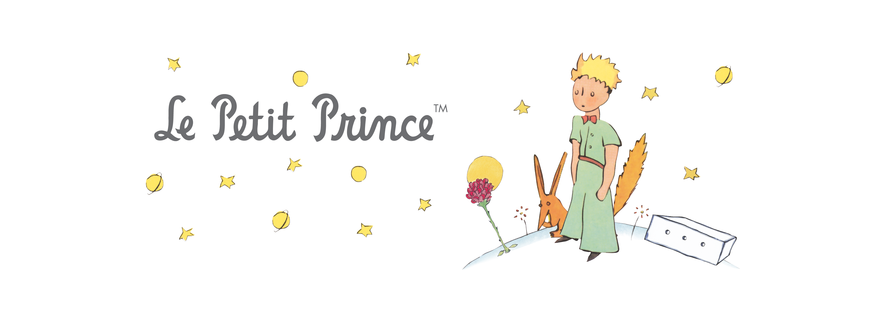
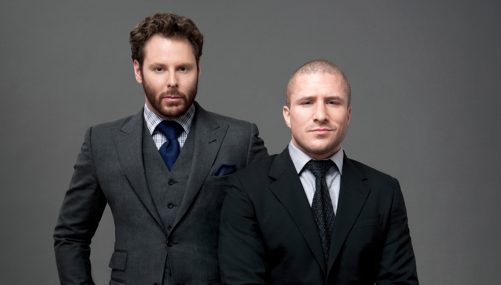
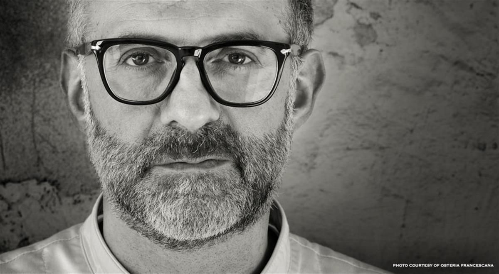
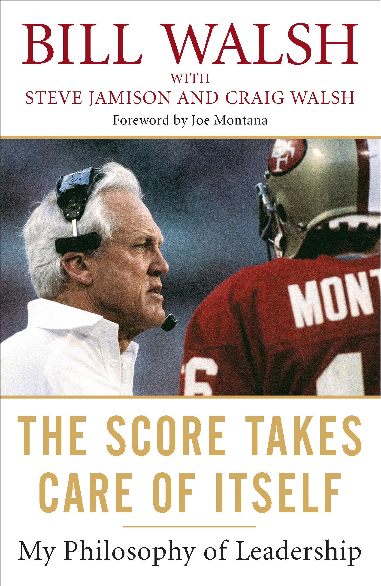
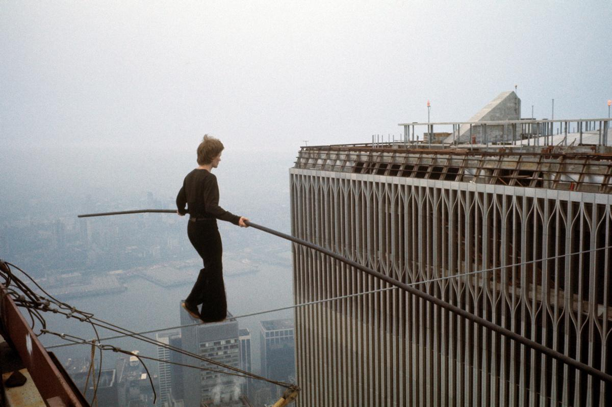
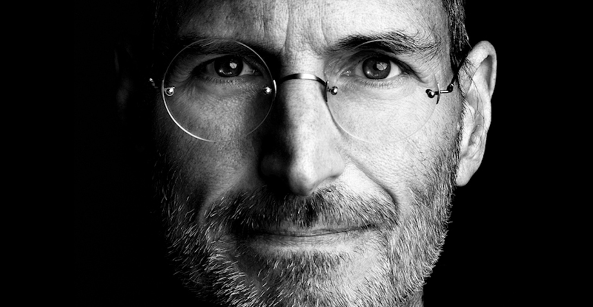
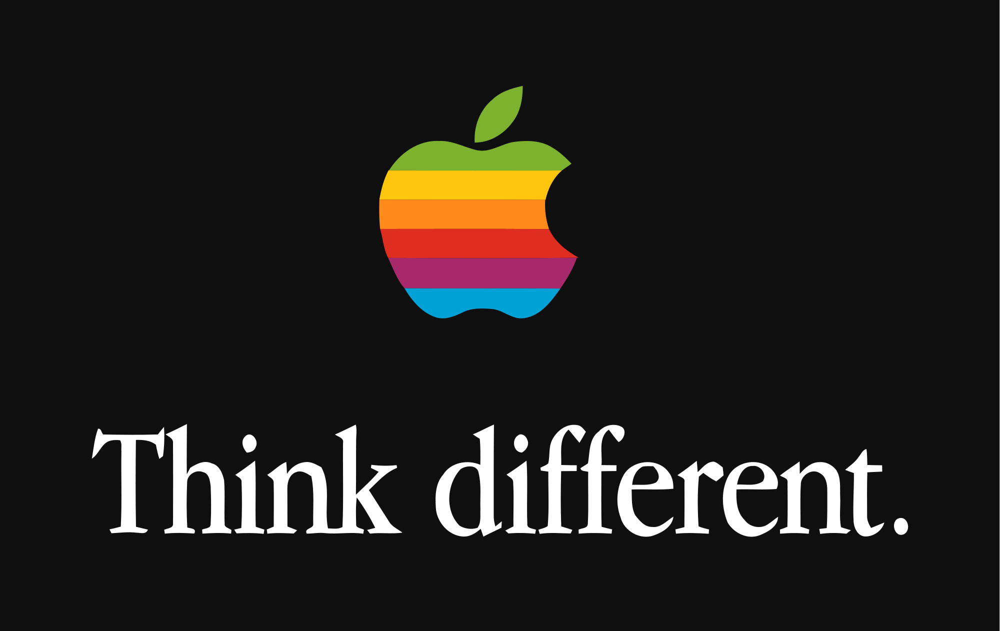

# [fit] *From zero to one*
### my path to ~~success~~ enjoy

—

# [fit]*@lucamaraschi*

^ and I think I’m the only one in this room who was not wearing a pair of Nike shoes…so I went to the store and buy one! ;-)

—

# [fit]entrepreneur
# [fit]**software architect**

—

# [fit]**4** startups

—

> Your main skill is too see through people, connect them and stitch them together under your vision.
— Giorgio Sardo, Senior Director Microsoft Corp

—

# Just a story

—

# **My life**

^ our life is the best story that we can tell

—

# started **32** years ago

—

## in family of **entrepreneurs**

—

# [fit]**Celso Nidasio**
### my grandpa

—

# *One day*
# *he…*

—

—

> To my engineer full of dreams

—

# **dreams** make you **fly**

—

# make you **explore** the world

—

# [fit]restaurant entrepreneur

—

# [fit] engineering and *kitchens*

—

# [fit]**CHEFS**
# [fit] similar to
# [fit]**Taylors**

—

# **crafting** not only with your hands

—

# but with your **mind** and your **creativity**

—

# need to **read** customers **mind**

—

> “Yours it’s a passion, and you can see it by how you are touching your instruments and by the way you are gently caressing the fabric like if this was alive.”
— Silvano Agosti, *Il sarto delle anime*

—

> “The future has already arrived. It’s just not evenly distributed yet.”
— Necromancer by Gordon R. Dickson

^ An idea can happen any time…the important thing is to inspire other to do it.

—

# [fit]**VISION**

^ The vision becomes then the most important thing

—

# [fit]DISRUPTION

—

# [fit] is CHAOS

^ Lack of order and direction…imagine like a bunch of particles all independently moving…

—

# [fit] is missing **the**
# [fit] **direction**

—

^ Build a vision of what I want to see in the world
^ Have a horizon in front of my eyes
^ It’s fundamental to be able to walking backward that point and still be able to see it

—

###  I’m looking for a
# [fit]**PURPOSE**

—

# [fit] **REVOLUTION**
^ I like more to think about revolution, very positive, historical…
^ Imagine for example the French revolution

—

# Positive
# result

—

# [fit]**COESIVE**

—

# [fit]it’s shared
^ The goal of the revolution is shared among a group of people who are “fighting” for the same goal, the all aim to the same result.

—

^ Sean Parker and Shawn Fanning, creators of Napster

—

# [fit] Chefs
# [fit] are artists

—

—

—-

> “The score takes care of itself”
— Bill Walsh

—

# [fit] **Standard of excellence**

—

# [fit] **Listen**
# [fit] Learn
# [fit] **Lead**

—-

^ It’s really important to let your people believe in the impossible

—

—

—

^ The whole earth epilog by Stewart Brand

—

> “You can't connect the dots looking forward; you can only connect them looking backwards. So you have to trust that the dots will somehow connect in your future.”
— Steve Jobs, Commencement speech at Stanford University

—

# [fit]Thank you
# [fit]to all the people who **inspired** me

—

# [fit] Thank you all
# [fit] for **listening**.