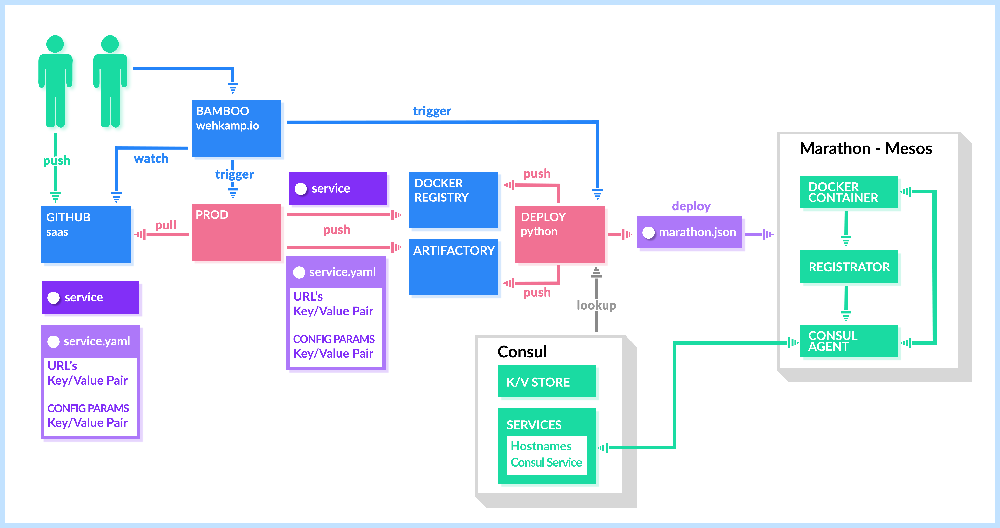
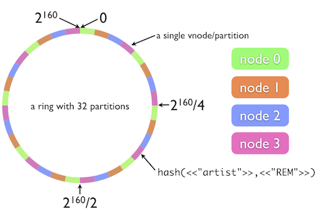
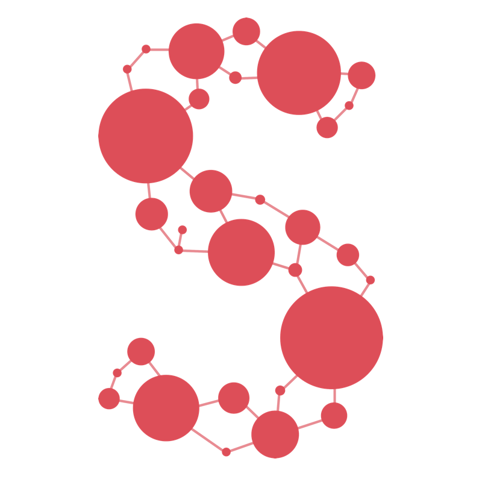
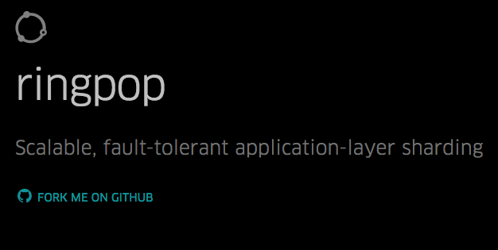
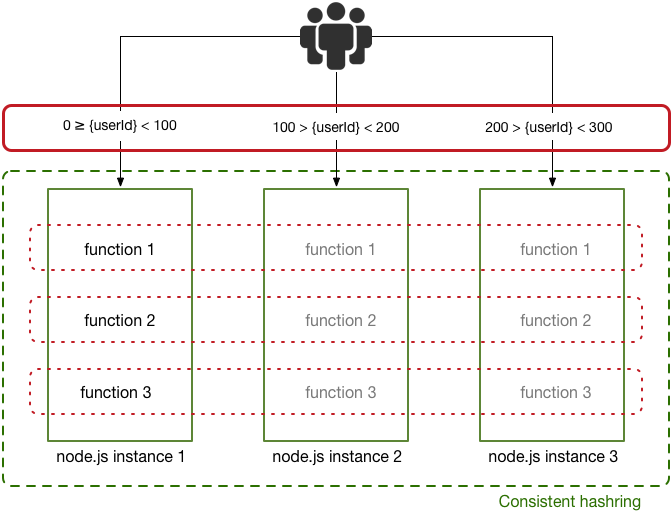
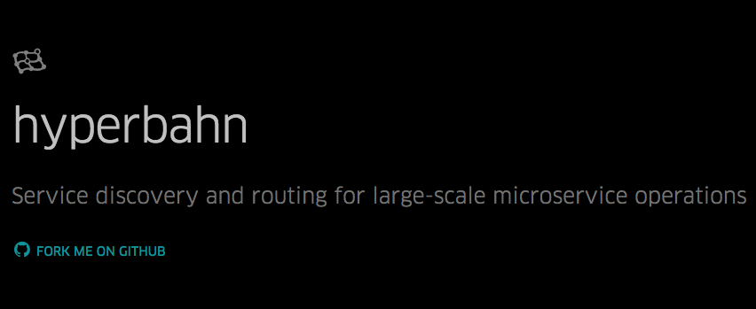
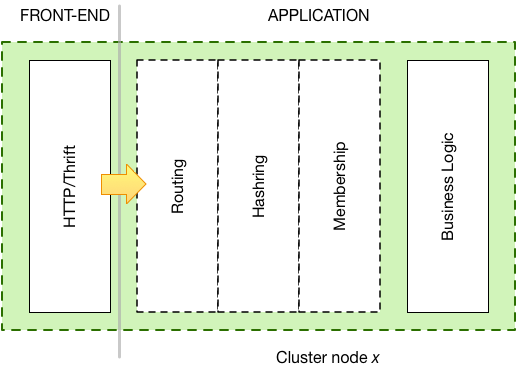

# [fit] **SWIMming**
# [fit] in the microservices Ocean

—

# [fit] @lucamaraschi

—

# [fit] once upon a time…

—

—

# [fit] and then **JAVA** came across…
# [fit] with the FAMOUS monolith

—

—

# [fit] “Divide et impera”

—

# [fit] then **MICROSERVICES**

—

—

—

# [fit] Success
# [fit] === more users

—

# [fit] more users
# [fit] === more compute power

—

# [fit] more “racks”
# [fit] === more distribution

—

—

# [fit] **Elasticity**

—

# [fit] AWS => **ELB**

—

# [fit] more “racks”
# [fit] === service discovery

—

# [fit] **docker…**
# [fit] does not solve the problem!

—

# [fit] NO **Resiliency**
# [fit] NO **Fault tolerance**

—

—

# [fit] welcome in 
# [fit] **devOps hell!**

—

# [fit] Ehm…

—

# [fit] till…

—

—

# [fit] **S**calable
# [fit] **W**eakly consistent
# [fit] **I**nfection style
# [fit] **M**embership protocol

—

# [fit] **Weakly consistent**
### vs. Strongly consistent

—

# [fit] **Failure detection**
### over the cluster

—

# [fit] **Information dissemination**

—

# [fit] Equally **distribution**
### of the workload

—

# [fit] Designed for
# [fit] **Distributed Systems**

—

—

# [fit] Add a node to the cluster
# [fit] How to rebalance the topology?

—

# [fit] **Consistent Hashring**

—

—

# [fit] WHY?
# [fit] WHAT?

—

# [fit] Partitioning

—

# [fit] **Predictable**
# [fit] Elasticity

—

# [fit] REPLICATION

—

# [fit] DISTRIBUTE STATE

—

# [fit] Edges are
# [fit] **NOT** stateless

—

—

—

—

# [fit] Application-level
# [fit] **Sharding**

—

# [fit] **DISTRIBUTION**
# [fit] in an eventual consistent universe

—

—

—

> Hyperbahn enables service discovery and routing for large-scale systems comprised of many microservices. Distributed, fault tolerant, and highly available, it lets one service find and communicate with others simply and reliably without having to know where those services run.

— Uber’s Documentation!

—

—

# [fit] λ

—

# [fit] “Serverless”
## is the new hipster!

